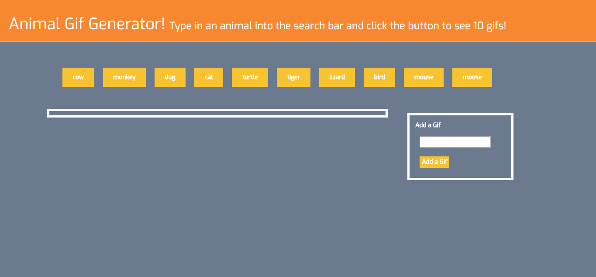
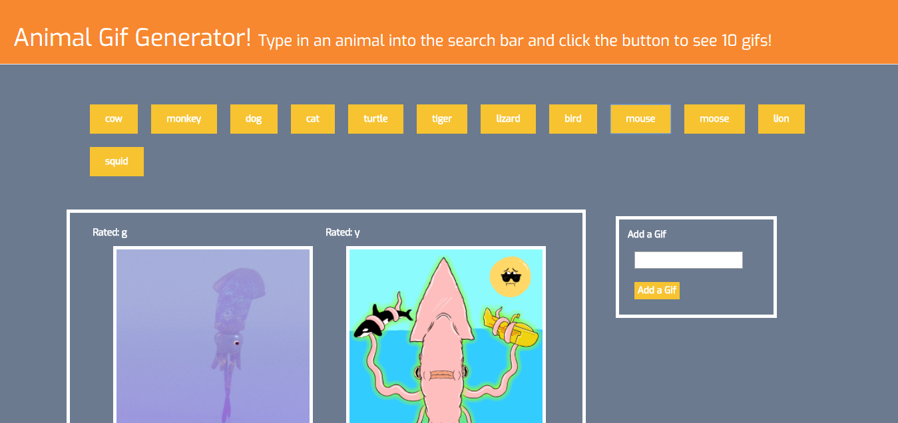

# GifTastic

This application is a Gif generator. 

The app uses ajaxs calls to pull data from the GiphyAPI. 

It is set up with a few preloaded buttons that the user can click to see Gifs of that animals. 

The user can also add a new button which will then be added to the buttons above and then can click on that new button to see Gifs of that animal. 

The user can also click on the Gifs to start and stop them.

## Languages Used

This application uses HTML, CSS, Bootstrap, JavaScript, and JQuery.